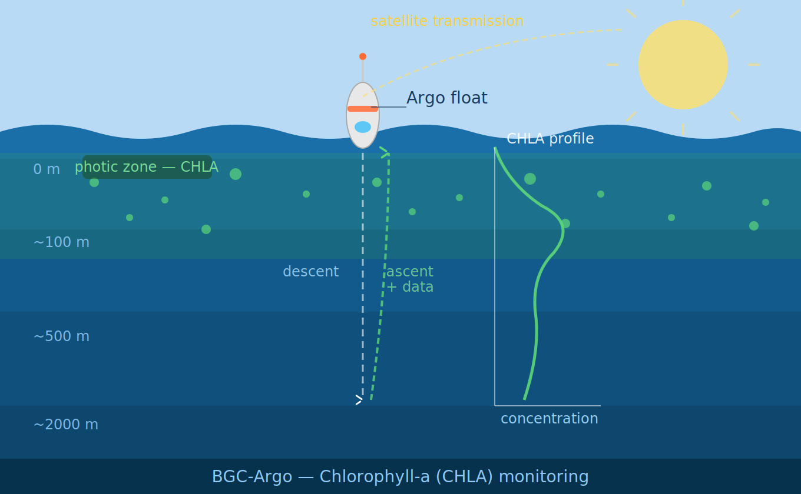

This June, real-time CHLA data distributed by the Argo system will undergo a major reprocessing. While this update will significantly improve data quality, it may also have important implications for users.

To help you understand what is changing and how it may affect your work, we strongly encourage you to attend the dedicated webinar.

📅 **Tuesday, May 12th** — 🕑 **14:00 UTC / 16:00 CEST**

**Raphaëlle Sauzède** *(Institut de la Mer de Villefranche)* will present:

> *"Chlorophyll-a update in BGC-Argo: What's Changing in June 2026, How It Works, and Why It Matters"*

👉 Registration is required — please make sure to sign up in advance: [Register here](https://washington.zoom.us/meeting/register/4eJz9UPNS3qXMls_PBJOBw)

